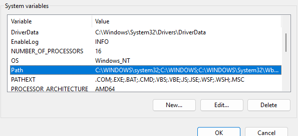
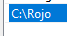
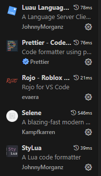
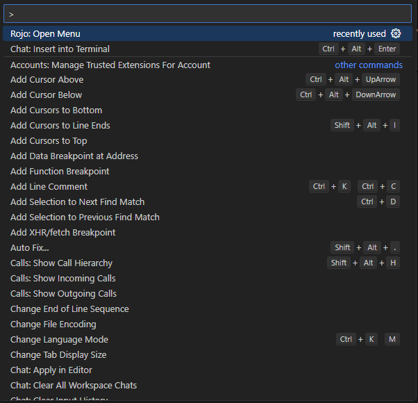
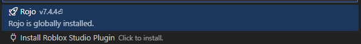
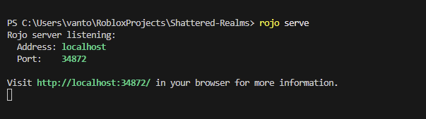
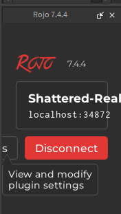

# Shattered-Realms
Roblox


# 🛠️ Setting Up Roblox Game Development with Rojo + VSCode

This guide walks you through setting up your development environment using **Rojo**,
**Visual Studio Code**, and **Roblox Studio** for a modular and scalable workflow.

---

## 📦 Requirements

- [✅] Roblox Studio
- [✅] Visual Studio Code
- [✅] Rojo (for syncing files)
- [✅] VSCode Rojo Plugin (optional, but useful)

---

## 🚀 Step-by-Step Setup

### 1. Install Roblox Studio
- Download and install Roblox Studio:  
  👉 [https://www.roblox.com/create](https://www.roblox.com/create)

---

### 2. Install Visual Studio Code
- Download and install VSCode:  
  👉 [https://code.visualstudio.com/](https://code.visualstudio.com/)

---

### 3. Install Rojo
Rojo is a tool that syncs your local files with Roblox Studio.

#### For Windows:
- Download the latest `.exe` release from GitHub:  
  👉 [https://github.com/rojo-rbx/rojo/releases](https://github.com/rojo-rbx/rojo/releases)
- Add it to your system PATH (optional but recommended).

#### For macOS (using Homebrew):
```bash
brew install rojo-rbx/rojo/rojo
```

#### For Linux:
- Download the release from GitHub and follow installation instructions for your distro.

---

### 4. Install the Rojo VSCode Extension (Optional)
This extension provides syntax highlighting and easier Rojo file management.

- Open VSCode → Extensions (`Ctrl+Shift+X`)
- Search for `Rojo` and install the official extension by **rojo-rbx**

- Once Rojo is installed, add it to your System Environment Path so Rojo can be used in any terminal.
- Make sure the path is equal to where the executable file lives. Mine is in my C Drive, in a folder called Rojo.
- You can move the .exe file anywhere you'd like.




- Install these plugins they are mandatory:



- THEN press Ctrl + Shift + P to open up the command in VsCode. You should see this:



- Then click on Rojo Menu and click install Roblox Studio Plugin. You must have Roblox Studio open during this step.



---

### 5. Set Up Your Project Structure

Your project folder might look like this:

```
MyGame/
├── default.project.json
├── src/
│   ├── client/
│   ├── server/
│   └── shared/
└── README.md
```

The `default.project.json` is what Rojo uses to map files to Roblox Studio.

Our default.project.json:
```json
"ReplicatedStorage": {
      "$path": "src/shared"
    },

    "ServerScriptService": {
      "Server": {
        "$path": "src/server"
      }
    },

    "StarterPlayer": {
      "StarterPlayerScripts": {
        "Client": {
          "$path": "src/client"
        }
      }
    },

    "StarterGui": {
      "UI": {
        "$path": "ui"
      }
    },
```

---

### 6. Start Rojo

In your terminal (within your project directory):

- Make sure you run rojo.serve in the command prompt inside your directory before you connect in Roblox Studio.
- This will open a local server and wait for Roblox Studio to connect.



---

### 7. Connect Roblox Studio

- Once installed, you should see this in order to be able to sync Rojo and Roblox Studio:




---

## 🧠 Tips

- 💾 Save changes in VSCode and see them reflect in Studio automatically.
- 🧪 You can use Studio for testing and live debugging, but **write and version all code in VSCode**.
- 🧩 Use Git to track your code history and collaborate effectively.

---

## Branching

- Make sure to make a branch named with whatever you like. Lets name the branch according to the current interation.
- Branch Name EX: Iteration-1_FixBug

---

## 🐛 Troubleshooting

- **Files not syncing?**
  - Make sure `rojo serve` is running.
  - Check your `default.project.json` for correct paths.
  - Ask Vantou
- **VSCode can’t find Rojo?**
  - Ensure Rojo is in your system’s PATH.
  - You can run it directly with the full path as a test.
  - Ask Vantou

---

Happy building! 🚀
```
